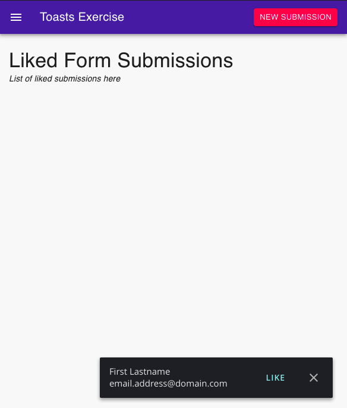

## Feature Requirements

We want to have toasts show up whenever we receive a message from the server that a new client just
signed up! It should look like something like:

It doesn't have to look exact.

### Requirements

* When you click "New Submission" your app must respond and show a toast
* Toasts that are "liked" are added to the list on the page
* Toasts that are dismissed are removed and you never see them again
* When you refresh the browser, the list must persist.
* (Bonus) Any level of polish you think would make for a good UX

### Hints

* Focus on getting the core requirements down first. Then work on polish if you have time
* If you use MUI, they have a `<Snackbar>` component that can be helpful.

## Submitting

Please submit your code, with commit messages, to a public git repository and reply to
the recruiting emails with the link to your repository.

------------------------

Create React App README
================

This project was bootstrapped with [Create React App](https://github.com/facebook/create-react-app).

## Available Scripts

In the project directory, you can run:

### `npm start`

Runs the app in the development mode.
Open [http://localhost:3000](http://localhost:3000) to view it in the browser.

The page will reload if you make edits.
You will also see any lint errors in the console.

### `npm test`

Launches the test runner in the interactive watch mode.
See the section about [running tests](https://facebook.github.io/create-react-app/docs/running-tests) for more information.

## Learn More

You can learn more in the [Create React App documentation](https://facebook.github.io/create-react-app/docs/getting-started).

To learn React, check out the [React documentation](https://reactjs.org/).
